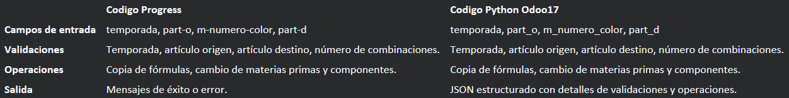

# Modulo Entregable Mantenimiento ficha Tecnica y Copia Receta ficha Tecnica. 

## Alcance del modulo

Modulo receta ficha tecnica. 

## Modelos Receta

### `temporadas.model`
- Fields:
  - `name` (Char)
  - `decription` (Char)

### `articulo.model`
- Fields:
  - `name` (Char)
  - `decription` (Char)
  - `_rec_name` (nombre)
  - `nombre` (Char)

### `codigosec.model`
- Fields:
  - `name` (Char)
  - `decription` (Char)
  - `_rec_name` (codigo)
  - `codigo` (Char)

### `componente.model`
- Fields:
  - `name` (Char)
  - `decription` (Char)
  - `_rec_name` (codigo)
  - `codigo` (Char)
  - `descripcion` (Text)
  - `um` (Char)

### `componente.descripcion.model`
- Fields:
  - `descripcion` (Text)

### `componente.um.model`
- Fields:
  - `um` (Char)

### `compmanu.model`
- Fields:
  - `name` (Char)
  - `decription` (Char)

### `cantidad.model`
- Fields:
  - `name` (Char)
  - `decription` (Char)

### `factperdida.model`
- Fields:
  - `name` (Char)
  - `decription` (Char)

### `cunitario.model`
- Fields:
  - `name` (Char)
  - `decription` (Char)

### `campliado.model`
- Fields:
  - `name` (Char)
  - `decription` (Char)

### `depto.model`
- Fields:
  - `name` (Char)
  - `decription` (Char)
____
_____________________________________________

## Modelos Copia Receta

### `copia.ficha`
- Fields:
  - `temporadas_id` (Char)
  - `temporada_name` (Char)
  - `sequence` (Char)
  - `part_O` (Char)
  - `part_d` (Char)
  - `m_numero_color` (Char)
  - `copia` (Char)
  - `m_modelo_o` (Char)
  - `m_modelo_d` (Char)
  - `no_combo_o` (Char)
  - `no_combo_d` (Char)
  - `remplaza` (Char)
  - `mensaje` (Char)
  - `xcuero` (Char)
  - `xcolor` (Char)
  - `xplanta` (Char)
  - `xcolfo` (Char)
  - `temporada` (Char)

_________________________________________________

### `Vista Formulario`
### `receta.ficha`
- Fields:
  - `temporadas_id` (Char)
  - `articulo_id` (Integer)

_________________________________________________

### `Vista Lista`
### `receta.ficha`
- Fields:
  - `codigosec_id` (Integer)
  - `componente_id` (Char)
  - `descripcion` (Text)
  - `comp_manu` (Char)
  - `cantidad_id` (Integer)
  - `fact_perdida_id` (Integer)
  - `c_unitario_id` (Float)
  - `c_ampliado_id` (Float)
  - `depto_id` (Char)

_________________________________________________

### `Vista Form Copia Lista`
### `copia.ficha`
- Fields:
  - `codigosec_id` (Integer)
  - `componente_id` (Char)
  - `descripcion` (Text)
  - `comp_manu` (Char)
  - `cantidad_id` (Integer)
  - `fact_perdida_id` (Integer)
  - `c_unitario_id` (Float)
  - `c_ampliado_id` (Float)
  - `depto_id` (Char)

_________________________________________________

### `Funciones`

  - (state)
  - `Funcion` (next_button)
  - `Funcion` (calcular_costo_ampliado)
  - `Funcion` (_onchange_componente_id)
  - `Funcion` (_check_nombre)
  - `Funcion` (name_get)
  - `Funcion` (_compute_nombre_receta)

  _________________________________________________
  
  ### `Cuadro Comparacion "codigo progress-codigo python"`
  
  
  
